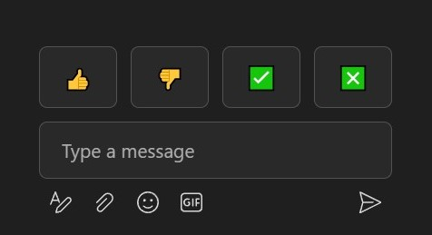

# Microsoft Teams Emoji Extension

Enhance your Microsoft Teams messaging experience with quick-access emojis reminiscent of WebEx style. This Tampermonkey extension adds a set of easily accessible emojis, including thumbs up, thumbs down, tick (yes), and cross (no), right at your fingertips.

## Installation

1. Make sure you have [Tampermonkey](https://chromewebstore.google.com/detail/tampermonkey/dhdgffkkebhmkfjojejmpbldmpobfkfo) installed in your browser.
2. Click [here](https://github.com/m4gni/teams/raw/main/teams.user.js) to open the script.
3. Tampermonkey will automatically recognise the script and prompt you to install it.
4. Confirm the installation.

## Usage

1. Open Microsoft Teams in your browser.
2. Join a meeting/class.
3. Locate the new emoji tray added above the chat box.
4. Click on the desired emoji to send it instantly.

## Contributing

Feel free to contribute to the project by forking the repository, making improvements, and submitting a pull request. Bug reports and feature requests are also welcome in the [issue tracker](https://github.com/m4gni/teams/issues).

## License

This project is licensed under the MIT License - see the [LICENSE](https://github.com/m4gni/teams/blob/main/LICENSE) file for details.
